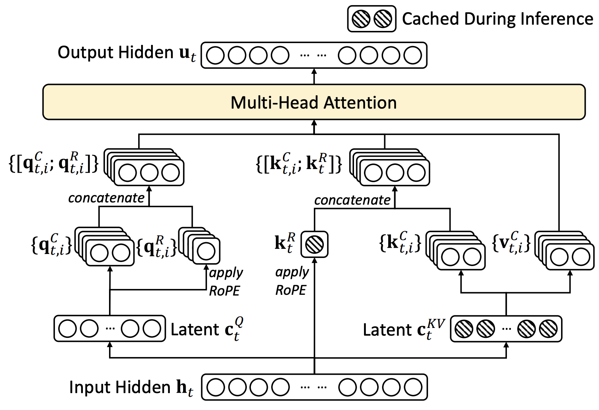
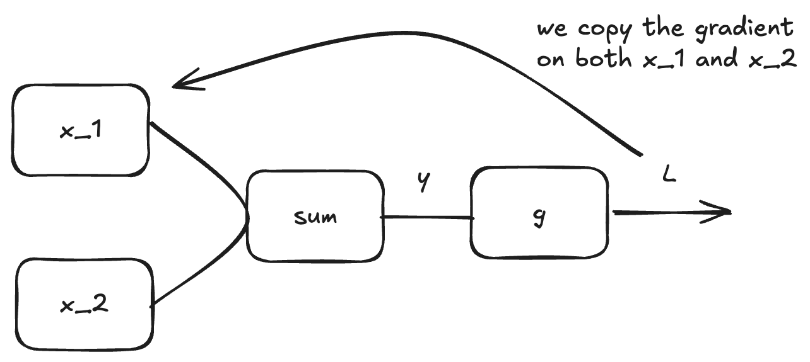
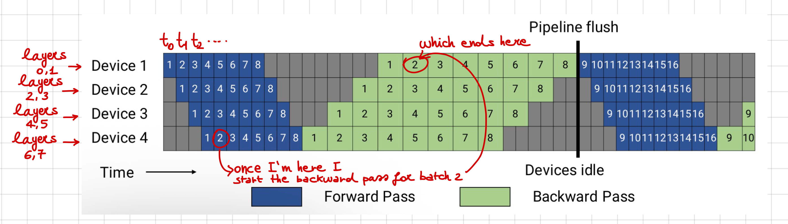
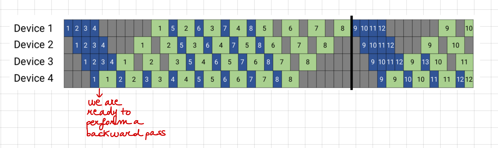
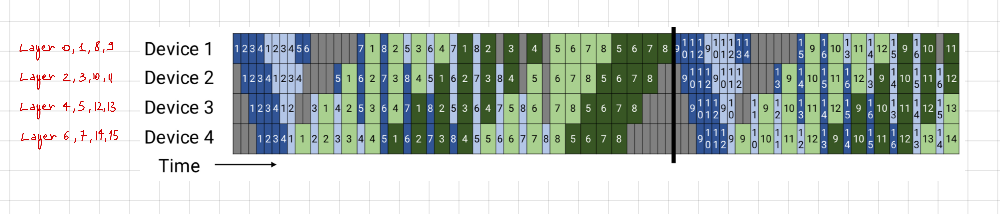
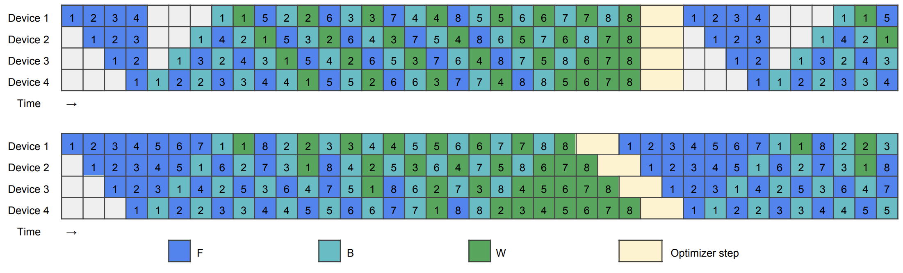
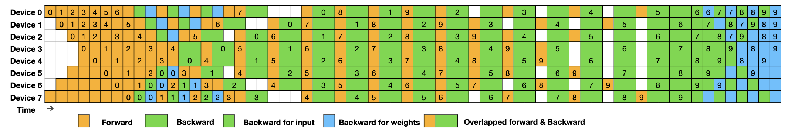
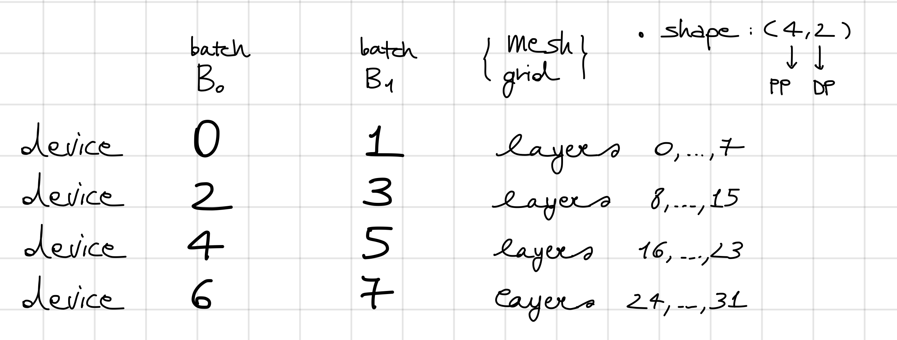

# Torchfeather

## About this project

I’m building this repository as a hands-on record of my progress learning how to train language models, especially across multiple GPUs. It brings together a training loop, experiments, and notes on ideas such as attention, Mixture-of-Experts, and distributed training. The project is still a work in progress: I’m testing approaches, improving the implementation, and refining my explanations as I learn. My aim is to make that process visible and share what I discover along the way. The [interactive experiment dashboard](docs/index.html) lets you explore the training and validation curves, compare run throughput, and inspect the final greedy samples. Open `docs/index.html` locally, or enable GitHub Pages with `docs/` as the publishing source to host it.

## Architecture

### MoE

A Mixture-of-Experts (MoE) layer replaces a single feed-forward network (FFN) with several expert FFNs and a router. For each token, the router scores the experts and selects the top $k$; only those routed experts process that token. A shared expert, when present, processes every token. This conditional computation lets a model increase its **total parameter capacity** without making every token use all of those parameters. The trade-off is that all expert weights still have to be stored or sharded, while routing adds dispatch, communication, and load-balancing costs. Sparse activation therefore reduces per-token expert computation relative to a dense model with the same total FFN capacity; it does not make the extra capacity free. This design was studied in large-scale language models such as [Switch Transformers](https://arxiv.org/abs/2101.03961).

It helps to distinguish total parameters from active parameters. Let $P_{\text{always}}$ count the weights used for every token (including dense layers and shared experts), $P_{\text{router}}$ the router weights, and $P_{\text{routed}}$ all routed-expert weights across the model. With $E$ equal-sized routed experts per MoE layer and top-$k$ routing, a rough per-token active-parameter count is

$$
P_{\text{active}} \approx P_{\text{always}} + P_{\text{router}} + \frac{k}{E}P_{\text{routed}}.
$$

This approximation assumes each expert is the same size and that each token activates $k$ experts at each MoE layer. More generally, the active routed parameters are the sum of the parameters in the experts selected for that token. In this repository's benchmark configuration, each MoE layer has four routed experts and selects two, alongside one shared expert.

For a dense linear layer, multiplying an $m\times k$ matrix by a $k\times n$ matrix costs about $2mnk$ floating-point operations (FLOPs). Because the backward pass for matrix multiplications is of similar order to the forward pass, a common rough estimate for training is $6P_{\text{active}}$ FLOPs per token, or $6NP_{\text{active}}$ for $N$ tokens. At inference, the corresponding parameter-multiplication estimate is about $2P_{\text{active}}$ FLOPs per token. These are leading-order estimates: attention adds a context-length-dependent cost, and routing, normalization, embeddings, and implementation details are not captured exactly. See this [derivation of Transformer FLOPs](https://jax-ml.github.io/scaling-book/transformers/#forward-and-reverse-flops) for more detail.

A further MoE design choice is expert **granularity**: how the FFN capacity is divided among experts. [Scaling Laws for Fine-Grained MoE](https://arxiv.org/abs/2402.07871) studies this as a model-design variable. In its notation, granularity is the ratio

$$
G = \frac{d_{\text{FFN}}}{d_{\text{expert}}},
$$

where $d_{\text{FFN}}$ is the reference FFN intermediate width and $d_{\text{expert}}$ is the intermediate width of one expert. For a fixed aggregate expert width, increasing $G$ corresponds to using more, narrower experts. This changes the trade-off between expert capacity, routing choices, and compute; the paper measures benefits in its tested settings, rather than establishing that finer granularity always improves every MoE.

The helper `get_nparams_and_flops` in [`torchfeather/model/model_args.py`](torchfeather/model/model_args.py) reports this repository's parameter and FLOPs estimates. Treat the FLOPs value as an analytical estimate, not a profiler measurement.

### Notation

From now on, we will use the following notation:

- We will try to refer to the hidden dimension of an embedded token always with $D$.

- $H$ will denote the number of heads.

- $T$ will usually denote the sequence length.


### Rotary Position Embedding (RoPE)


RoPE encodes each token's position in its representation. The [original Transformer paper](https://arxiv.org/abs/1706.03762) uses sinusoidal positional embeddings:

$$
\begin{cases}
PE_{(pos, 2i)} = \sin\left(pos / 10000^{2i/D}\right), \\
PE_{(pos, 2i + 1)} = \cos\left(pos / 10000^{2i/D}\right).
\end{cases}
$$

These embeddings directly encode absolute position. [RoPE](https://arxiv.org/abs/2104.09864) also applies a position-dependent transformation, but uses rotations so that the query-key attention score depends on relative position. In particular, for token representations $x_m$ and $x_n$ at positions $m$ and $n$, the desired form is

$$
\langle f_q(x_m, m), f_k(x_n, n) \rangle = g(x_m, x_n, m-n),
$$

where the score depends on the representations and their position difference, rather than on the absolute positions independently.

To see the idea in two dimensions, identify each 2D vector with a complex number and multiply it by a position-dependent phase. For an angle $\theta$, this phase is $e^{im\theta}$ at position $m$. The query and key use their respective learned projections, and their inner product then contains a phase factor determined by $m-n$:

$$
f_q(x,m) = (W_q x)e^{im\theta}, \qquad
f_k(x,n) = (W_k x)e^{in\theta}.
$$

Equivalently, in real coordinates the operation is a rotation:

$$
f(x,m) = R_{\theta,m}Wx,
\qquad
R_{\theta,m} =
\begin{bmatrix}
\cos(m\theta) & -\sin(m\theta) \\
\sin(m\theta) & \cos(m\theta)
\end{bmatrix}.
$$

This 2D operation extends to a vector of dimension $D$ by splitting it into $D/2$ pairs and rotating each pair, potentially with a different angle $\theta_i$. The range of angles gives the model access to different relative-position scales: larger angles rotate more quickly and represent finer position differences, while smaller angles rotate more slowly and represent broader distances.

In `rope.py`, the frequencies are computed as

```python
freqs = 1.0 / (base ** (torch.arange(0, dim, 2, dtype=torch.float32) / dim))
```

With this basic RoPE, generalization beyond the training context can still be difficult. At long distances, the high-frequency rotations may repeat or alias, while the slowest rotations complete relatively few cycles. This is an extrapolation limitation; RoPE still encodes relative position within its intended range.

How can a model trained with an $L$-token context window be adapted to use a longer $L'$-token window? One simple approach is to scale positions—for example, divide positions by $4$ when extending from $4{,}000$ to $16{,}000$ tokens. But uniform scaling also changes the high-frequency terms, which help distinguish nearby tokens. YaRN, introduced in [this paper](https://arxiv.org/abs/2309.00071), instead leaves some frequencies unchanged, scales others, and interpolates between the two behaviors.

Define

$$
r(i) = \frac{L}{\lambda_i},
\qquad
\lambda_i = \frac{2\pi}{\theta_i}.
$$

Then define the ramp coefficient

$$
\gamma(r) =
\begin{cases}
0, & r < \alpha, \\
1, & r > \beta, \\
\dfrac{r-\alpha}{\beta-\alpha}, & \text{otherwise},
\end{cases}
$$

and the adjusted frequency

$$
h(\theta_i) = \left(1-\gamma(r(i))\right)\theta_i
              + \gamma(r(i))\frac{\theta_i}{s}.
$$

In the ramped region, this interpolates from $\theta_i$ to $\theta_i/s$. Since $s>1$, the adjusted frequency is lower and the wavelength is longer. The implementation in `rope.py` applies a linear ramp over frequency indices; its direction depends on the indexing convention.

### Initialization of the weights

Consider a linear layer $y = Wx$, where $x$ has $p$ independent, zero-mean features, each with variance $v$. Suppose the entries in each row of $W$ are independent, zero-mean, independent of $x$, and have variance $\sigma^2$. For an output coordinate $y_j = \sum_{i=1}^{p} W_{ji}x_i$, the cross terms vanish under these assumptions, giving

$$
\operatorname{Var}(y_j) = \sum_{i=1}^{p} \operatorname{Var}(W_{ji}x_i) = p v \sigma^2.
$$

If we choose the weight variance so that the output variance matches the input variance, then

$$
\operatorname{Var}(y_j) = \operatorname{Var}(x_i) = v
\quad\Longrightarrow\quad
\sigma = \frac{1}{\sqrt{p}}.
$$

This is the basic intuition behind fan-in-based initialization: scaling weights by the inverse square root of the number of inputs helps keep activation variance from growing or shrinking in a linear layer.

For a residual stream, consider the update

$$
x_{\ell+1} = x_{\ell} + f_{\ell}(x_{\ell})
$$

Its variance is

$$
\operatorname{Var}(x_{\ell+1}) = \operatorname{Var}(x_{\ell})
 + \operatorname{Var}(f_{\ell}(x_{\ell}))
 + 2\operatorname{Cov}(x_{\ell}, f_{\ell}(x_{\ell})).
$$

At initialization, a common approximation is that the residual branch is close to uncorrelated with the residual stream, so the covariance term is small:

$$
\operatorname{Cov}(x_{\ell}, f_{\ell}(x_{\ell})) \approx 0.
$$

The branch is not independent of the residual stream, since it receives $x_{\ell}$ as input; this is an approximation about their covariance at initialization. If each residual branch has standard deviation $\sigma_f$ and this covariance is negligible, then after $L$ layers with one residual branch per layer,

$$
\operatorname{Var}(x_L) \approx \operatorname{Var}(x_0) + L\sigma_f^2.
$$

With two residual branches per layer, the accumulated contribution is approximately $2L\sigma_f^2$. If the initial residual stream has variance near $1$ and we want that variance to remain roughly constant, this suggests a branch standard deviation on the order of

$$
\sigma_f \approx \frac{1}{\sqrt{2L}}.
$$

The DeepSeek initialization used in this repository includes this depth-dependent scaling:

```python
self.weight_init_std = 0.02 / (2 * (layer_id + 1)) ** 0.5
```

The standard deviation therefore decreases with layer depth. The goal is to control how residual-branch contributions accumulate, helping stabilize signal variance during training.

### Self-Attention

Autoregressive decoding can become memory-bandwidth-bound, especially at small batch sizes. A GPU has two relevant limits: **compute throughput**, or how quickly it performs arithmetic, and **memory bandwidth**, or how quickly it moves data between high-bandwidth memory (HBM) and the compute units.

For example, the H100 SXM figures used here are a peak BF16 Tensor Core throughput of 1,979 teraFLOPs, 80 GB of HBM, and 3.35 TB/s of memory bandwidth. Their ratio gives a simplified roofline balance point. The corresponding quantity, **arithmetic intensity**, is the number of FLOPs performed per byte transferred:

$$
\text{Arithmetic intensity} =
\frac{\text{FLOPs performed}}{\text{bytes read and written}}.
$$

For these H100 figures, the balance point is

$$
\frac{1979 \cdot 10^{12}\ \text{FLOPs/s}}
     {3.35 \cdot 10^{12}\ \text{bytes/s}}
\approx 590\ \text{FLOPs/byte}.
$$

In this simplified roofline model, an operation needs an arithmetic intensity above roughly 590 FLOPs per byte to be compute-bound; below that point, memory bandwidth limits throughput.

Consider a matrix multiplication $Y=WX$, where $W\in\mathbb{R}^{n\times n}$ and $X\in\mathbb{R}^{n\times B}$. With BF16 values, reading $W$ costs about $2n^2$ bytes, and reading $X$ and writing $Y$ costs about $2nB$ bytes each. The multiplication performs about $2n^2B$ FLOPs, so its arithmetic intensity is

$$
\text{AI} \approx
\frac{2n^2B}{2n^2+2nB+2nB}
= \frac{nB}{n+2B}\ \text{FLOPs/byte}.
$$

When the hidden dimension $n$ is much larger than the batch size $B$, the weights dominate memory traffic and $\text{AI}\approx B$. At batch size $B=1$, this is roughly 1 FLOP per byte—well below the H100 balance point—so autoregressive decoding at small batches is strongly memory-bandwidth-bound.

For attention, [this paper](https://arxiv.org/abs/1911.02150) gives an inverse arithmetic-intensity scaling of approximately

$$
\frac{1}{\text{AI}} = O\left(\frac{n}{D}+\frac{1}{B}\right),
$$

where $n$ is the context length, $D$ the hidden dimension, and $B$ the batch size. During decoding, each new token supplies one query, while attention must read the cached keys and values for the preceding tokens. The cache traffic grows with context length, so reducing the size of the KV cache can improve decoding throughput. In this simplified accounting, attention performs $O(BD^2+BnD)$ arithmetic and reads $O(BnD)$ KV-cache elements; thus

$$
\frac{1}{\text{AI}} = O\left(\frac{1}{B}+\frac{n}{D}\right).
$$

The $n/D$ term becomes more significant for long-context decoding.

**Vanilla MHSA** Let $h_t\in\mathbb{R}^{D}$ be the representation at position $t$, with $H$ query heads of dimension $d_h=D/H$. For head $i$, the causal attention weight assigned to an earlier position $j\leq t$ is

$$
a_{t,j,i}=\frac{\exp(q_{t,i}^{T}k_{j,i}/\sqrt{d_h})}
{\displaystyle\sum_{r=1}^{t}\exp(q_{t,i}^{T}k_{r,i}/\sqrt{d_h})}.
$$

Each head forms a weighted sum of its value vectors, and the output projections combine the heads:

$$
o_{t,i}=\sum_{j=1}^{t}a_{t,j,i}v_{j,i},
\qquad
\mu_t=\sum_{i=1}^{H}W_i^o o_{t,i}.
$$

In standard multi-head attention (MHSA), each query head has its own key and value head. Each token therefore adds $2Hd_h=2D$ scalar values to the KV cache per layer. More generally, with $n_{kv}$ KV heads of dimension $d_h$, each token adds $2n_{kv}d_h$ values per layer. The corresponding storage in bytes depends on the cache dtype.

**Multi-Query Attention (MQA)** keeps the $H$ query heads but uses a single key head and a single value head shared by all of them, so $n_{kv}=1$. The cache then stores $2d_h$ values per token per layer, compared with $2Hd_h$ for standard MHSA—an $H$-fold reduction at the same context length and cache dtype. During autoregressive decoding, this also reduces the KV data that must be read for each new query.

More generally, if there are $n_{kv}$ KV heads, the same inverse-arithmetic-intensity estimate becomes

$$
\frac{1}{\text{AI}}=O\left(\frac{1}{B}+\frac{n}{d_h n_{kv}}\right).
$$

Reducing $n_{kv}$ lowers cache traffic, which can help when decoding is memory-bandwidth-bound. The trade-off is that all query heads must use the same key/value representation; this can affect model quality. MQA was introduced in [Multi-Query Attention](https://arxiv.org/abs/1911.02150).

**Grouped-Query Attention (GQA)** is a compromise: it uses fewer KV heads than query heads, but more than one. Each KV head is shared by a group of query heads. This reduces cache storage relative to MHSA while retaining more KV heads than MQA; see [Grouped-Query Attention](https://arxiv.org/abs/2305.13245).


**Multi-Head Latent Attention (MLA)** reduces KV-cache storage by keeping a compressed content latent and a compact rotary key for each token, rather than separate full-width content keys and values for every head. The diagram summarizes the inference path described in the [DeepSeek-V2 paper](https://arxiv.org/abs/2405.04434).



In this implementation, `wkv_a` projects the token representation into a compressed KV latent and a separate positional-key component:

```python
self.wkv_a = nn.Linear(
    self.dim,
    self.kv_lora_rank + self.qk_rope_head_dim,
    bias=False,
)
```

The first `self.kv_lora_rank` output dimensions form the KV latent $c_t^{kv}$. The remaining `self.qk_rope_head_dim` dimensions form the rotary key component $k_t^R$; the query has a corresponding positional component $q_t^R$. The latent is up-projected to produce content keys and values for all heads:

```python
self.wkv_b = nn.Linear(
    self.kv_lora_rank,
    self.n_heads * (self.qk_nope_head_dim + self.v_head_dim),
    bias=False,
)
```

Use superscript $d$ for down-projections and $u$ for up-projections. The compressed latent is

$$
c_t^{kv}=W^{dkv}h_t,
\qquad
W^{dkv}\in\mathbb{R}^{d_c\times D},
$$

where $d_c$ is the latent dimension. For head $i$, the content key and value are

$$
k^c_{t,i}=W^{uk}_i c_t^{kv},
\qquad
v^c_{t,i}=W^{uv}_i c_t^{kv},
\qquad
W^{uk}_i,W^{uv}_i\in\mathbb{R}^{d_h\times d_c}.
$$

The key inference-time optimization is to avoid reconstructing each content key. If $q_{t,i}=W_i^q h_t$, then

$$
q_{t,i}^{T}k^c_{j,i}
= (W_i^q h_t)^T W_i^{uk}c_j^{kv}
= \left[(W_i^{uk})^T W_i^q h_t\right]^T c_j^{kv}.
$$

The product $(W_i^{uk})^T W_i^q$ is fixed for a fixed model, so the two matrices can be combined into one query projection. At inference, this maps the query into the latent KV space, where it can be scored directly against cached $c_j^{kv}$ vectors without materializing $k^c_{j,i}$.

The same idea applies to the values. The attention output for head $i$ is

$$
o_{t,i}
=\sum_j a_{t,j,i}v^c_{j,i}
=W_i^{uv}\sum_j a_{t,j,i}c_j^{kv}.
$$

Define the attention-weighted latent as

$$
\overline{o}_{t,i}=\sum_j a_{t,j,i}c_j^{kv}.
$$

Then the output projection can be combined with the value up-projection:

$$
\mu_t=\sum_i W_i^o o_{t,i}
=\sum_i W_i^o W_i^{uv}\overline{o}_{t,i}.
$$

Because $W_i^oW_i^{uv}$ is fixed during inference, it can also be precomputed. Attention can then use the cached latent vectors and positional keys without repeatedly reconstructing the full content keys and values.

**Why separate `NoPE` and `RoPE` components?** The absorption above works when the query and key projections are fixed across positions. RoPE inserts a position-dependent rotation into their score. For a query at position $m$ and a key at position $n$, it has the form

$$
q_m^T k_n=(W^q x_m)^T R_{\theta,m-n}W^k x_n.
$$

If the content-key term in MLA also included RoPE, its score would contain a rotation $R_{t,j}$ between the query and key projections. Since this rotation depends on both token positions, it cannot be folded into one fixed projection matrix.

MLA avoids this by splitting each query and key into **content** and **positional** components:

$$
q_{t,i}=[q^c_{t,i},q^r_{t,i}],
\qquad
k_{t,i}=[k^c_{t,i},k^r_t].
$$

The attention score is the sum of the content score and the positional score:

$$
q^T_{t,i}k_{j,i}
=(q^c_{t,i})^Tk^c_{j,i}+(q^r_{t,i})^Tk^r_j.
$$

The content term contains no RoPE, so its projections can be absorbed as described above. The positional term carries the RoPE information and is computed separately.

The code absorbs the content-key projection into the query projection with

```python
wq_abs_nope = torch.bmm(
    w_uk.float().transpose(1, 2),
    wq_nope.float(),
).to(dtype=dtype)
```

Here `w_uk` has shape `[n_heads, qk_nope_head_dim, kv_lora_rank]`. Transposing its last two dimensions gives `[n_heads, kv_lora_rank, qk_nope_head_dim]`. Multiplying by `wq_nope` produces `wq_abs_nope` with shape `[n_heads, kv_lora_rank, dim]`. This absorbed matrix maps each hidden state directly into the compressed KV latent space used by the cache.

### Basics of backpropagation

Let's consider the case of a NN with L layers. We have
$$
z^{(\ell)} = w^{(\ell)} a^{(\ell-1)} + b^{(\ell)}
$$
and
$$
a^{(\ell)} = \sigma(z^{(\ell)})
$$
for $\ell = 1, \dots, L$ with $a^{(0)} = x$. Now one has
$$
\frac{\partial C}{\partial a^{(\ell)}} = \frac{\partial C}{\partial a^{(\ell + 1)}} \frac{\partial a^{(\ell+1)}}{\partial z^{(\ell+1)}} \frac{\partial z^{(\ell+1)}}{\partial a^{(\ell)}} = \frac{\partial C}{\partial a^{(\ell + 1)}} \sigma^{'}(z^{(\ell)}) w^{(\ell+1)}
$$
Then once I have all
$$
\frac{\partial C}{\partial a^{(\ell)}}
$$
we do
$$
\frac{\partial C}{\partial w^{(\ell)}} = \frac{\partial C}{\partial a^{(\ell)}} \frac{\partial a^{(\ell)}}{\partial z^{(\ell)}} \frac{\partial z^{(\ell)}}{\partial w^{(\ell)}} = \frac{\partial C}{\partial a^{(\ell)}} \sigma'(z^{(\ell)})a^{(\ell-1)}
$$

Now, assume
$$
L(x) := h(\mu(x), \nu(x))
$$
then
$$
\frac{\partial L}{\partial x} = \frac{\partial L}{\partial \mu} \frac{\partial \mu}{\partial x} + \frac{\partial L}{\partial \nu} \frac{\partial \nu}{\partial x}
$$
Now, say we have
$$
L = g(x_{1}+x_{2})
$$
where $x_{1}, x_{2}$ come from different GPUs. Then we copy the gradient of $L$ wrt $y$ on both GPUs.



#### PyTorch backpropagation

A quick intro on `PyTorch` implementation of backpropagation. The idea is the following. Assume now we have black-boxes:
$$
x \to f_{1}(x, w_{1})=:y_{1} \to f_{2}(y_{1}, w_{2})=:y_{2} \to \dots \to f_{n}(y_{n-1}, w_{n})=:y_{n}
$$
Then, if we want to compute the partial derivatives of the loss wrt the params
$$
\frac{\partial L}{\partial \omega_{i}} = \frac{\partial L}{\partial y_{i}} \frac{\partial y_{i}}{\partial \omega_{i}}
$$
and for
$$
\frac{\partial L}{\partial y_{i-1}} = \frac{\partial L}{\partial y_{i}} \frac{\partial y_{i}}{\partial y_{i-1}}
$$
so each black-box implements a way to do the `backward` pass, i.e. given the gradient wrt the outputs of that black-box, it gives you back the gradient wrt the inputs and weights.
$$
\frac{\partial L}{\partial y_{i}} \xrightarrow{} \frac{\partial L}{\partial y_{i-1}}
$$
Let's consider the following example from the PyTorch docs

```python
class QKVProjection(Function):
    """Projects input x into Q, K, V: q = x @ w_q, k = x @ w_k, v = x @ w_v."""
    boxed_grads_call = True

    @staticmethod
    def forward(ctx, x, w_q, w_k, w_v):
        ctx.save_for_backward(x, w_q, w_k, w_v)
        return x.mm(w_q), x.mm(w_k), x.mm(w_v)

    @staticmethod
    def backward(ctx, grads):
        x, w_q, w_k, w_v = ctx.saved_tensors
        grad_x = torch.zeros_like(x)
        grad_weights = []

        # Process each grad independently and free it immediately.
        # Without boxed_grads_call, all three grads would stay alive
        # until backward returns, tripling peak grad memory.
        for i, w in enumerate((w_q, w_k, w_v)):
            grad_out = grads[i]
            grads[i] = None      # Release reference in the caller's list
            grad_x += grad_out.mm(w.t())
            grad_weights.append(x.t().mm(grad_out))
            del grad_out         # grad_out can now be freed by the runtime

        return grad_x, *grad_weights
```

Let `o_1, o_2, o_3 = x.mm(w_q), x.mm(w_k), x.mm(w_v)`, where `o` denotes an output. The `backward` pass receives one output gradient for each branch: $G_q=\partial L/\partial o_1$, $G_k=\partial L/\partial o_2$, and $G_v=\partial L/\partial o_3$.

Since `forward(ctx, x, w_q, w_k, w_v)` has four inputs, `backward` must return four gradients in the same order: for $x$, $W_q$, $W_k$, and $W_v$.

For one branch, such as $q=xW_q$, the gradients are

$$
\begin{aligned}
\left.\frac{\partial L}{\partial x}\right|_q &= G_qW_q^\top, \\
\frac{\partial L}{\partial W_q} &= x^\top G_q.
\end{aligned}
$$

Since $x$ feeds all three branches, its total gradient is the sum of the contributions from each:

$$
\frac{\partial L}{\partial x}
=G_qW_q^\top+G_kW_k^\top+G_vW_v^\top.
$$

The loop accumulates this input gradient:

```python
grad_x = torch.zeros_like(x)
for i, w in enumerate((w_q, w_k, w_v)):
    grad_out = grads[i]
    grad_x += grad_out.mm(w.t())
```

The three weight gradients are

$$
\begin{aligned}
\frac{\partial L}{\partial W_q} &= x^\top G_q, \\
\frac{\partial L}{\partial W_k} &= x^\top G_k, \\
\frac{\partial L}{\partial W_v} &= x^\top G_v.
\end{aligned}
$$

They correspond to the entries in `grad_weights`:

```python
grad_weights[0] = x.T @ G_q  # dL/dW_q
grad_weights[1] = x.T @ G_k  # dL/dW_k
grad_weights[2] = x.T @ G_v  # dL/dW_v
```

Thus, `backward` returns `(grad_x, grad_W_q, grad_W_k, grad_W_v)`, matching the order of its inputs.

## Distributed training

### An example - DDP
Assume we have $4$ GPUs, and consider
$$
\begin{aligned}
& x_{0} \xrightarrow{} GPU_{0} \xrightarrow{} (y_{0}, \text{target}_{0}) \xrightarrow{} \ell_{0}, \\
& x_{1} \xrightarrow{} GPU_{1} \xrightarrow{} (y_{1}, \text{target}_{1}) \xrightarrow{} \ell_{1}, \\
& x_{2} \xrightarrow{} GPU_{2} \xrightarrow{} (y_{2}, \text{target}_{2}) \xrightarrow{} \ell_{2}, \\
& x_{3} \xrightarrow{} GPU_{3} \xrightarrow{} (y_{3}, \text{target}_{3}) \xrightarrow{} \ell_{3}, \\
\end{aligned}
$$
And fortunately
$$
\frac{\partial L}{\partial \theta} = \frac{1}{4} \left( \frac{\partial \ell_{0}}{\partial \theta} + \frac{\partial \ell_{1}}{\partial \theta} + \frac{\partial \ell_{2}}{\partial \theta} + \frac{\partial \ell_{3}}{\partial \theta}\right)
$$
First of all, `torchrun` sets all the enviroments variables like `LOCAL_RANK`, `WROLD_SIZE`, `RANK`, etc. We access them for example as:
```python
world_size = int(os.environ['WORLD_SIZE'])
local_rank = int(os.environ['LOCAL_RANK'])
```
### Pipeline Parallelism
Pipeline parallelism partitions a model's layers into sequential stages placed on different devices. For example, an eight-layer model could be split across four GPUs, with two consecutive layers on each GPU. Activations move forward from stage to stage during the forward pass; gradients move in the reverse direction during backpropagation.

A naive schedule leaves most devices idle while an input passes through the stages one at a time. Pipeline schedules split a batch into smaller **microbatches** so different stages can work at the same time.

**GPipe** runs the forward pass for a sequence of microbatches through the pipeline, then runs their backward passes. This increases overlap, but the pipeline still has idle periods while it fills and drains (the *pipeline bubbles*). See the [GPipe paper](https://arxiv.org/abs/1811.06965).



A **one-forward-one-backward (1F1B)** schedule starts alternating forward and backward microbatches once the pipeline reaches its steady state. This lets stages release activations sooner than a schedule that completes all forward microbatches before beginning backward. The figure below shows an example.



For a linear layer, the backward pass computes both an input gradient and a weight gradient. These require roughly two matrix multiplications, compared with one for the forward pass, so backward computation is about twice the forward compute in this simplified example.

An **interleaved 1F1B** schedule assigns multiple, non-contiguous model chunks (virtual stages) to each device. For example, one device might hold layers 0–1 and 8–9, while another holds layers 2–3 and 10–11. Interleaving can reduce pipeline bubbles, at the cost of additional communication and scheduling complexity; see the [Megatron-LM paper](https://arxiv.org/abs/2104.04473).



**Zero-bubble schedules** split a layer's backward computation into two parts: the input-gradient computation, $\partial L/\partial x$, which is needed to continue backpropagation to the previous stage, and the weight-gradient computation, $\partial L/\partial W$, which is needed for the optimizer update. Because the weight gradient can be delayed, a schedule can place that work into otherwise idle slots. The [Zero Bubble paper](https://arxiv.org/abs/2401.10241) develops schedules around this split.



[DualPipe](https://github.com/deepseek-ai/DualPipe) extends this idea with a bidirectional schedule designed to overlap computation and communication.



To implement a schedule, represent it as a table: rows identify devices or stages, columns identify time steps, and each cell specifies the operation scheduled there. Communication must be paired: each `torch.distributed.isend` needs a matching `torch.distributed.irecv`.

During pretraining, fixed-length examples can be built by packing documents together with BOS and EOS markers instead of padding each document separately. For example:

- `BOS + sequence1 + EOS + BOS + sequence2`
- `sequence2 + EOS + BOS + sequence3`

This differs from typical post-training data preparation. Data-parallel dataloaders should also give each rank a distinct batch or data shard.

[`torchrun`](https://docs.pytorch.org/docs/2.14/elastic/run.html) starts distributed workers and sets variables such as `WORLD_SIZE`, `RANK`, and `LOCAL_RANK`. A single-node launch with one worker per GPU looks like this:
```bash
torchrun \
  --rdzv-backend=c10d \
  --rdzv-endpoint=localhost:0 \
  --nnodes=1 \
  --nproc-per-node="$NUM_TRAINERS" \
  YOUR_TRAINING_SCRIPT.py [args...]
```

For example, set `NUM_TRAINERS=8` to use eight GPUs on one node. For multi-node jobs, Slurm can allocate the nodes and tasks; `torchrun` then launches workers using the rank information for that allocation.

### Device mesh

Pipeline parallelism is often combined with data parallelism and tensor parallelism. A **device mesh** gives each rank a coordinate along each parallelism dimension and defines which ranks communicate for a given operation.

For example, with 16 ranks, four ranks can form each pipeline, while corresponding pipeline stages are replicated for independent batches. After processing those batches, replicas holding the same model stage synchronize their gradients.

The diagram below shows a pipeline/data-parallel layout:



Mesh dimension order controls rank placement. Ranks that communicate frequently are usually placed along dimensions with smaller strides, so their rank IDs are closer together.

For a mesh with shape `(2, 2, 4)` and strides `(8, 4, 1)`, suppose the axes are `dp_replicate`, `dp_shard`, and `TP`, respectively. Rank 14 has coordinates `(1, 1, 2)`:

- `dp_replicate`: `14 // 8 = 1`, remainder `6`.
- `dp_shard`: `6 // 4 = 1`, remainder `2`.
- `TP`: `2 // 1 = 2`.

These coordinates identify the communication groups. Rank 14's tensor-parallel group contains ranks with coordinates `(1, 1, i)` for `i = 0, 1, 2, 3`. Its `dp_shard` peer has coordinates `(1, 0, 2)`.
